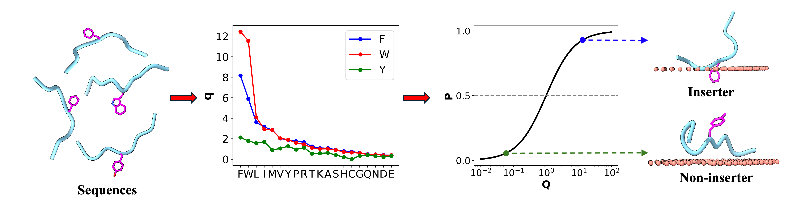

# AroMIP — Aromatic Membrane Insertion Predictor

[](https://fidhanazreen.github.io/AroMIP/)
[](LICENSE)

> **AroMIP** predicts whether aromatic-centered motifs in intrinsically disordered proteins (IDPs) insert into the acyl-chain region of lipid membranes — directly in your browser, no installation required.

---

## Overview

Intrinsically disordered proteins (IDPs) frequently interact with cellular membranes through short hydrophobic motifs centered on aromatic residues (Phe, Trp, Tyr). These membrane-inserting motifs play key roles in signaling, aggregation, and pathological processes. AroMIP provides a fast, interpretable score for each such motif in any query sequence.



---

## How It Works

### 1. Fragment Scanning
The tool scans the input sequence and extracts every **9-residue window** whose **center residue (position 5)** is an aromatic amino acid — **F**, **W**, or **Y**.

### 2. Multiplicative Scoring Model
Each flanking residue (positions 1–4 and 6–9) contributes a **multiplicative factor** derived from training on intrinsically disordered regions of the human proteome. The raw insertion propensity *Q* is the product of all eight flanking factors for the central aromatic type:

$$Q = \prod_{\substack{i=1 \\ i \neq 5}}^{9} \alpha_i^{(\text{AA}_i)}$$

where $\alpha_i^{(\text{AA}_i)}$ is the trained weight for the amino acid at position *i*, specific to the central aromatic (F, W, or Y).

### 3. Generalized Sigmoid
*Q* is converted to a membrane-insertion propensity score *P* ∈ [0, 1) via a generalized sigmoid:

$$P = \begin{cases} \dfrac{Q}{1 + Q} & \text{if } Q > 0 \\ 0 & \text{otherwise} \end{cases}$$

### 4. Classification

| Score *P* | Prediction     |
|-----------|----------------|
| > 0.5     | **Inserter**   |
| ≤ 0.5     | Non-inserter   |

---

## Using the Web Tool

1. **Open** the [live demo](https://fidhanazreen.github.io/AroMIP/).
2. **Paste or type** your protein sequence (single-letter amino acid codes) into the text box.
3. Click **Predict!** — results appear instantly in a table below.
4. Use **Input Example** to try the demo sequence `RRNKFGINRTTGNWRGMLQRDLYSGLN`.

Each row in the results table shows:

| Column | Description |
|--------|-------------|
| **Motif** | 9-residue fragment centered on the aromatic residue |
| **Membrane-insertion propensity (P)** | Score from 0 to 1 |
| **Prediction** | Inserter or Non-inserter |

---

## Example

Input sequence:
```
RRNKFGINRTTGNWRGMLQRDLYSGLN
```

Expected output includes motifs centered on F, W, and Y, each scored and classified. The model correctly captures the hydrophobic context favoring membrane insertion.

---

## Model Details

The model parameters were trained separately for **F**, **W**, and **Y** as the central aromatic residue. Residues with strong positive weights (> 1) in the flanking positions — such as Ile, Leu, Val, Met, and other aromatics — generally promote membrane insertion, while charged and polar residues (Asp, Glu, Asn, Gln) suppress it.

---

## Citation

If you use AroMIP in your research, please cite:

> Fidha Kunnath Muhammedkutty and Huan-Xiang Zhou (2026).  
> **A membrane insertion code for intrinsically disordered proteins.**  
> *bioRxiv.*

---

## Author

**Fidha Nazreen Kunnath Muhammedkutty**  
PhD Candidate, Department of Chemistry  
University of Illinois Chicago  
